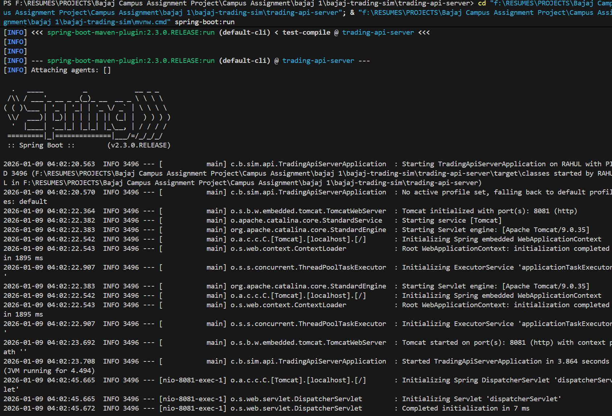
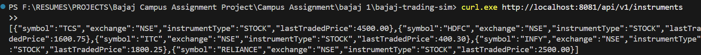
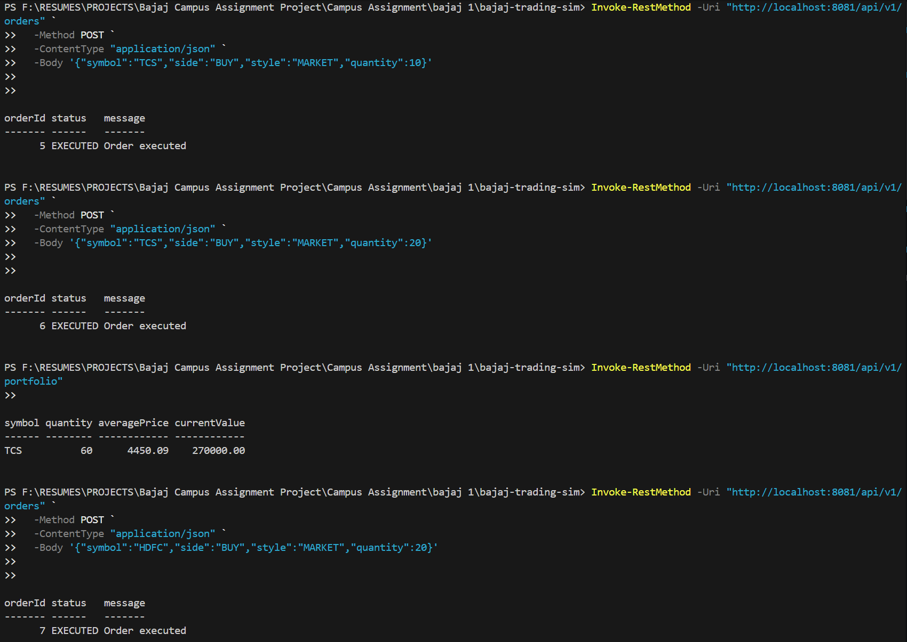
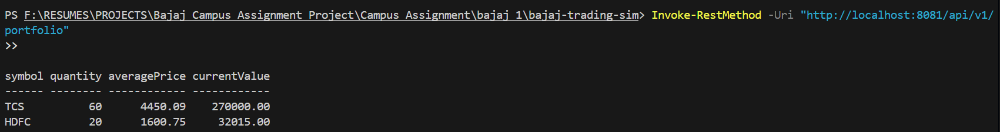

# Bajaj Trading Sim (bajaj-trading-sim)

A **simplified Trading API simulation** with a **wrapper SDK**, built for the Bajaj Broking Campus Hiring Assignment.

This project demonstrates core trading workflows:
- View tradable instruments
- Place BUY/SELL orders (MARKET / LIMIT)
- Check order status
- View executed trades
- Fetch portfolio holdings

 **No real market connectivity** is used.  
 Data is stored in-memory (reset on restart).  
 Authentication is mocked (single user).

---

## 1) Project Overview

This solution is intentionally kept **simple and student-friendly** while still following good backend practices.

### Modules
This is a Maven multi-module project:

1. **trading-api-server**  
   Spring Boot REST API backend exposing trading endpoints.

2. **trading-sdk**  
   A thin Java SDK wrapper to call the REST APIs using typed methods.

3. **scenario-runner**  
   A demo program that uses the SDK to simulate an end-to-end trading flow.

---

## 2) Architecture

### High Level Flow
```

Scenario Runner  --->  Trading SDK  --->  Spring Boot REST API  --->  In-memory Storage

````

- The **Scenario Runner** is just for demo and testing.
- The **SDK** hides raw HTTP and JSON handling from the client.
- The **REST API server** implements the required endpoints.
- Storage is **in-memory** using Map/List (no database required for this assignment).

---

## 3) Tech Stack

- **Language:** Java 13
- **Backend:** Spring Boot (REST APIs, JSON)
- **Build Tool:** Maven
- **Storage:** In-memory collections (Map/List)
- **API format:** JSON
- **Demo:** Scenario runner using SDK

Optional (if present in your project):
- Swagger/OpenAPI
- Unit/Integration tests

---

## 4) Setup & Run Instructions (Step-by-step)

### Prerequisites
- Java 13+ installed
- Maven installed OR use the included Maven wrapper (`mvnw` / `mvnw.cmd`)

>  On Windows PowerShell, use `mvnw.cmd`.

---

### Step A: Build the entire project
From project root:

```powershell
cd bajaj-trading-sim
.\mvnw.cmd clean install
````

Expected: `BUILD SUCCESS`

---

### Step B: Start the backend server (Terminal 1)

```powershell
cd .\trading-api-server
..\mvnw.cmd spring-boot:run
```

Look for:

* `Tomcat started on port(s): 8081`
* `Started TradingApiServerApplication`

> Note: My server runs on **[http://localhost:8081](http://localhost:8081)** (configured in `application.yml`).

---

### Step C: Run the demo scenario (Terminal 2)

Open a new terminal:

```powershell
cd bajaj-trading-sim\scenario-runner
..\mvnw.cmd exec:java
```

This will:

* fetch instruments
* place a MARKET order
* show order result
* fetch portfolio
* (optionally) run additional simulation logic

---

## 5) API Details (Assignment Coverage)

Base URL:

```
http://localhost:8081
```

All endpoints are under:

```
/api/v1
```

---

### 5.1 Instrument APIs

####  Fetch list of tradable instruments

**Endpoint**

```
GET /api/v1/instruments
```

**Returns fields**

* `symbol`
* `exchange`
* `instrumentType`
* `lastTradedPrice`

**Sample Curl (PowerShell)**

```powershell
curl.exe http://localhost:8081/api/v1/instruments
```

**Sample Response**

```json
[
  {
    "symbol": "TCS",
    "exchange": "NSE",
    "instrumentType": "STOCK",
    "lastTradedPrice": 4500.00
  }
]
```

---

### 5.2 Order Management APIs

####  Place a New Order

**Endpoint**

```
POST /api/v1/orders
```

**Supported**

* Order Side: `BUY` / `SELL`
* Order Style: `MARKET` / `LIMIT`

**Validations**

* `quantity` must be `> 0`
* `price` is mandatory for LIMIT orders

---

##### Example 1: MARKET BUY (immediate execution)

**PowerShell**

```powershell
Invoke-RestMethod -Uri "http://localhost:8081/api/v1/orders" `
  -Method POST `
  -ContentType "application/json" `
  -Body '{"symbol":"TCS","side":"BUY","style":"MARKET","quantity":10}'
```

**Sample Response**

```json
{
  "orderId": 4,
  "status": "EXECUTED",
  "message": "Order executed"
}
```

---

##### Example 2: LIMIT BUY (price required)

```powershell
Invoke-RestMethod -Uri "http://localhost:8081/api/v1/orders" `
  -Method POST `
  -ContentType "application/json" `
  -Body '{"symbol":"TCS","side":"BUY","style":"LIMIT","quantity":10,"price":4400}'
```

Expected behavior:

* If limit condition matches current LTP → order may execute
* Otherwise → order remains PLACED

---

##### Example 3: Validation failure (quantity = 0)

```powershell
Invoke-RestMethod -Uri "http://localhost:8081/api/v1/orders" `
  -Method POST `
  -ContentType "application/json" `
  -Body '{"symbol":"TCS","side":"BUY","style":"MARKET","quantity":0}'
```

Expected:

* HTTP 400 Bad Request
* JSON error response (format depends on implementation)

---

####  Fetch Order Status

**Endpoint**

```
GET /api/v1/orders/{orderId}
```

**Supported order states**

* `NEW`
* `PLACED`
* `EXECUTED`
* `CANCELLED` (included as a supported state)

**Example**

```powershell
Invoke-RestMethod -Uri "http://localhost:8081/api/v1/orders/4" -Method GET
```

**Sample Response**

```json
{
  "orderId": 4,
  "symbol": "TCS",
  "side": "BUY",
  "style": "MARKET",
  "quantity": 10,
  "price": null,
  "status": "EXECUTED"
}
```

---

### 5.3 Trade APIs

####  Fetch executed trades

**Endpoint**

```
GET /api/v1/trades
```

**Example**

```powershell
Invoke-RestMethod -Uri "http://localhost:8081/api/v1/trades" -Method GET
```

**Sample Response**

```json
[
  {
    "tradeId": 1,
    "orderId": 4,
    "symbol": "TCS",
    "side": "BUY",
    "quantity": 10,
    "price": 4500.00,
    "timestamp": "2026-01-09T00:10:00Z"
  }
]
```

---

### 5.4 Portfolio APIs

####  Fetch current portfolio holdings

**Endpoint**

```
GET /api/v1/portfolio
```

**Portfolio fields**

* `symbol`
* `quantity`
* `averagePrice`
* `currentValue`

**Example**

```powershell
Invoke-RestMethod -Uri "http://localhost:8081/api/v1/portfolio" -Method GET
```

**Sample Response**

```json
[
  {
    "symbol": "TCS",
    "quantity": 10,
    "averagePrice": 4500.00,
    "currentValue": 45000.00
  }
]
```

---

## 6) Assumptions Made

To keep the project aligned with the assignment scope (simulation, not production integration), the following assumptions are made:

1. **No real exchange connectivity**
   Prices and executions are simulated using instrument `lastTradedPrice`.

2. **In-memory storage**
   Orders, trades, and holdings are stored in memory, so **restart resets all data**.

3. **Single mocked user**
   Authentication is mocked: all orders/trades/portfolio belong to a single hardcoded user.

4. **Execution simulation rules**

   * MARKET orders execute immediately at current LTP.
   * LIMIT order execution depends on price condition vs LTP (simple simulation).

5. **Portfolio calculation**
   Portfolio is derived from executed trades and current instrument price.

---

## 7) Sample API Usage (Recommended Demo Flow)

For a simple demonstration in front of interviewers, run these 3 calls:

### 1) Fetch instruments

```powershell
curl.exe http://localhost:8081/api/v1/instruments
```

### 2) Place MARKET order

```powershell
Invoke-RestMethod -Uri "http://localhost:8081/api/v1/orders" `
  -Method POST `
  -ContentType "application/json" `
  -Body '{"symbol":"TCS","side":"BUY","style":"MARKET","quantity":10}'
```

### 3) Fetch portfolio

```powershell
Invoke-RestMethod -Uri "http://localhost:8081/api/v1/portfolio"
```

---

## 8) Screenshots / Evidence

1. Server running logs (Tomcat started on port 8081)
2. GET /instruments output
3. POST /orders response
4. GET /portfolio output
5. Scenario runner output (optional)


## Screenshots

### 1) Server started successfully


### 2) Fetch Instruments API


### 3) Place MARKET Order


### 4) Portfolio Output



## 9) How to Reset Data (In-memory storage)

Since storage is in-memory:

* Stop the server (Ctrl+C)
* Start again with `spring-boot:run`

This resets orders/trades/portfolio.

---

## 10) Notes 

Key points 

* REST endpoints are resource-based (`/instruments`, `/orders`, `/trades`, `/portfolio`)
* MARKET vs LIMIT simulation
* SDK wraps APIs so clients don’t handle raw HTTP/JSON
* Scenario runner demonstrates end-to-end workflow

---

## 11) Optional: Swagger/OpenAPI (if enabled)

If configured, Swagger UI can be accessed at:

* `/swagger-ui/index.html`

Example:

```
http://localhost:8081/swagger-ui/index.html
```

---
